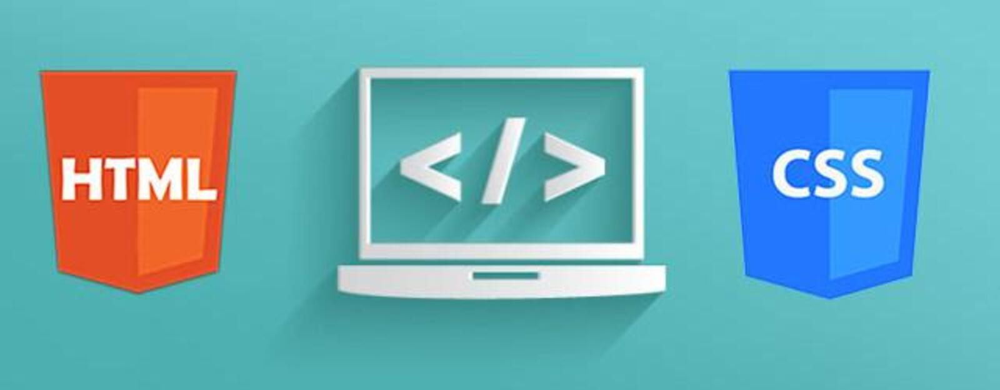
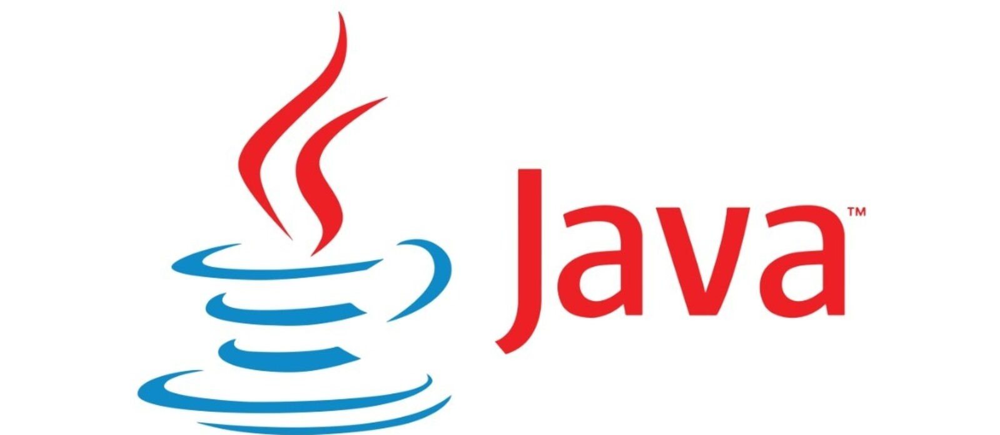

   
   <h1 align="center">¡Hola 👋! mi nombre es Ricardo Fraga 👨🏻‍💻</h1>
    
 
      
    

   <h2 align="center">Bienvenido a mi GitHub!</h2>

  

   
- 🔭 Front End Developer Loading.........
- 🔭 Estoy estudiando CFGS Desarrollo de Aplicaciones Web.
- 🌱 Actualmente estoy aprendiendo Git & GitHub.
- 📫 Contáctame por mi Linkedin: <i class="fab fa-linkedin">https://www.linkedin.com/in/ricaardev/</i>
   

## Tecnologías:

 

 

## Redes:

### ✍️ Frase Dev del Día

 <h2 align="center">Mis proyectos:</h2>

### Proyecto TiendaMueble:

### HTML & CSS: Curso práctico avanzado:

### Ejercicios Java:

